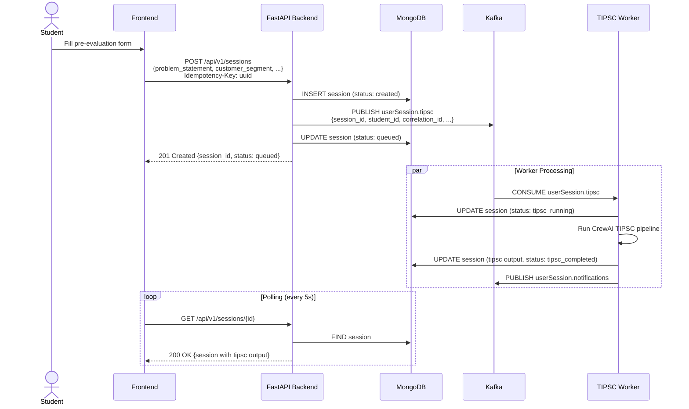
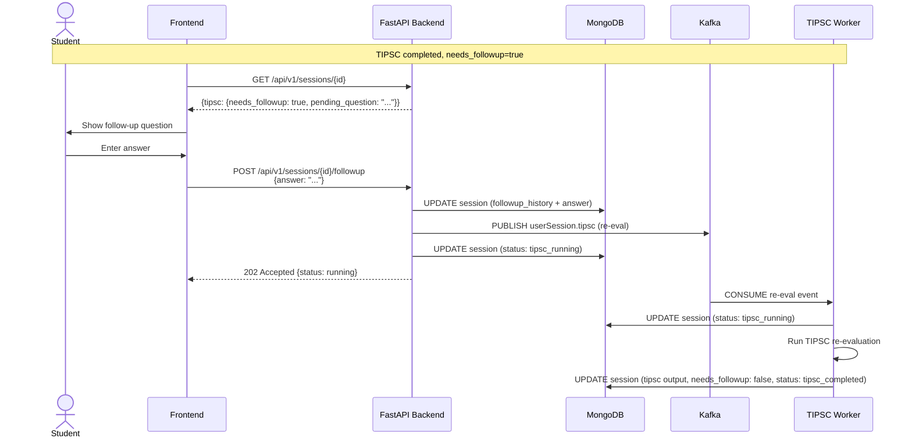
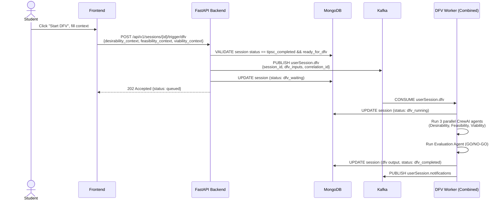
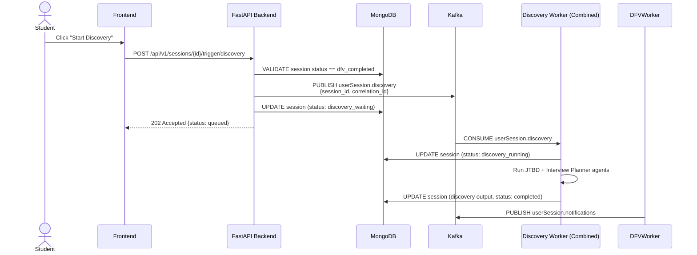
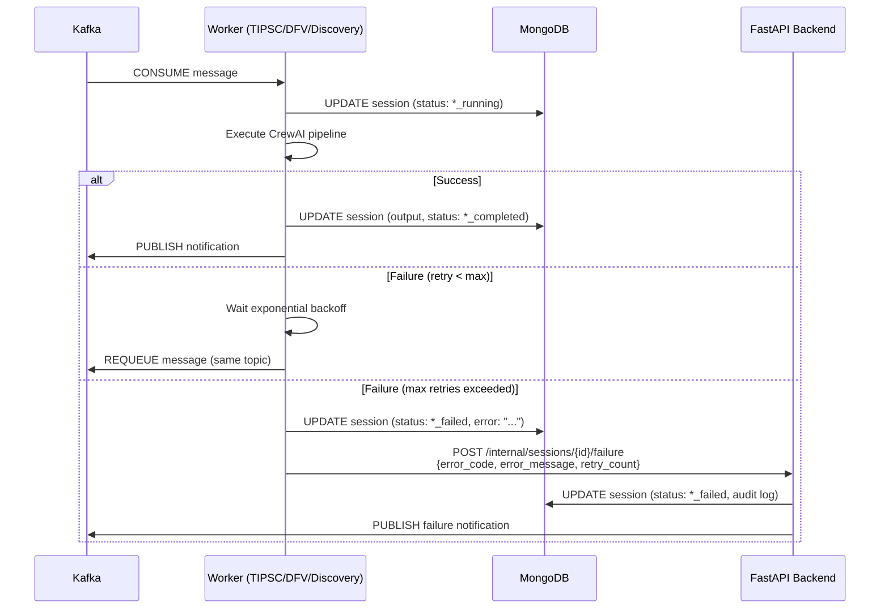
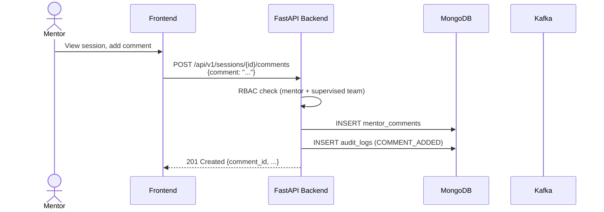
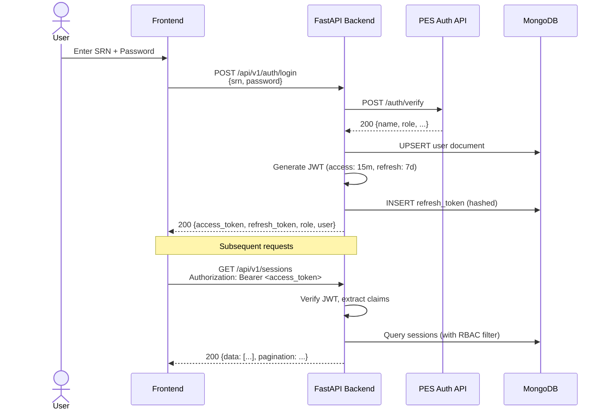
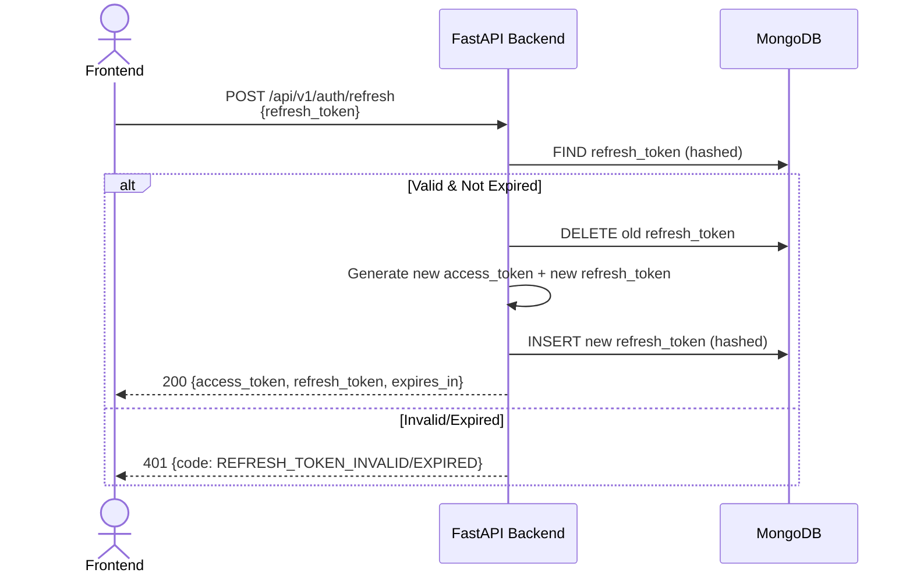
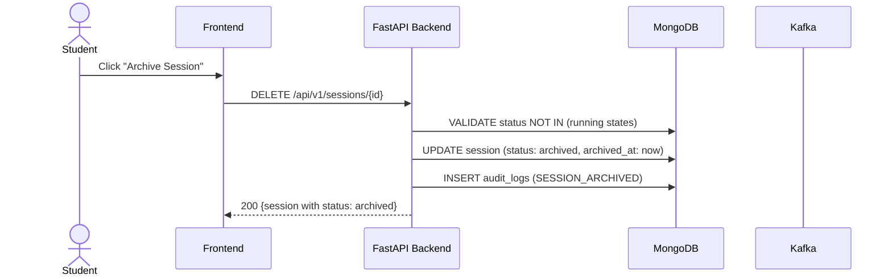

# Sequence Diagrams

This document contains Mermaid sequence diagrams for the key workflows in the AGIS platform.

---

## 1. Session Creation & TIPSC Trigger

---

## 2. TIPSC Follow-up Loop

---

## 3. DFV Flow

---

## 4. Discovery Flow

---

## 5. Worker Failure & Retry

---

## 6. Mentor Comment Flow

---

## 7. Authentication Flow

---

## 8. Token Refresh

---

## 9. Archive Session

---

## Diagram Rendering

These diagrams are written in [Mermaid](https://mermaid.js.org/) syntax. Render them in:
- GitHub/GitLab markdown
- VS Code with Mermaid extension
- Notion, Obsidian, or any Mermaid-compatible viewer
- [Mermaid Live Editor](https://mermaid.live/)